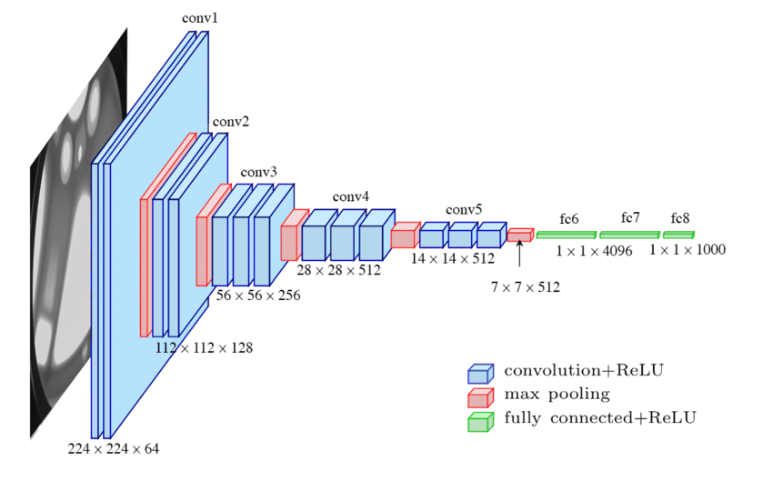
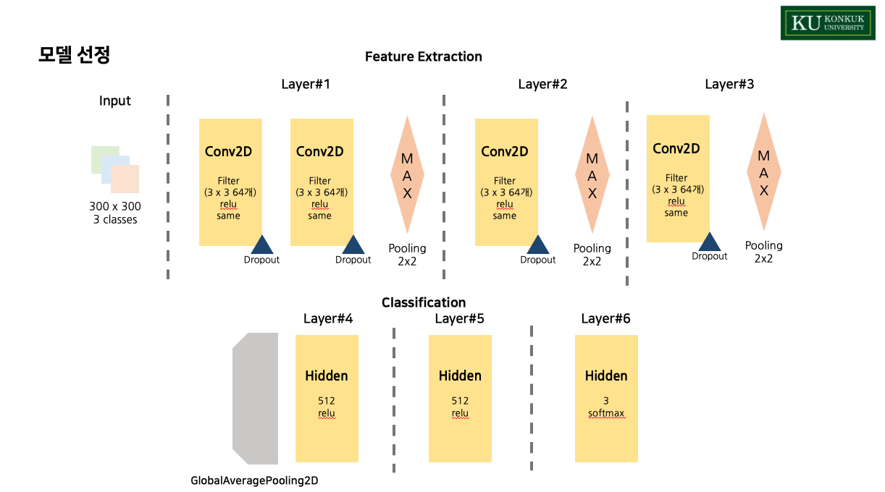
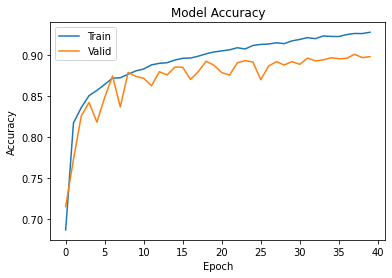
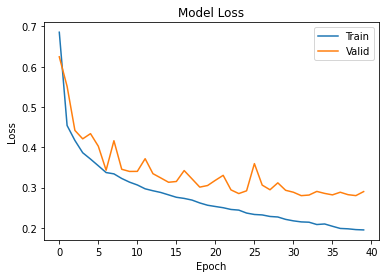
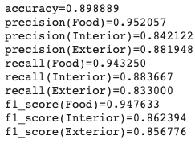

# Keras-food-image-classification
2020년 2학기 데이터사이언스개론 과목 기말고사 대체 과제인 Keras를 통한 음식-실내-실외 이미지 분류 입니다.
CNN 모델을 만들어 기존에 제공된 DataSet(45,000장)을 활용해 학습시키고 임의의 데이터(10,000장)을 통해 모델의 성능을 평가하였습니다.

## 과제 개요
1. 음식 및 식당 사진에 대하여 '음식', '실내', '실외'등으로 자동 분류하는 Image Classification 프로그램 개발
2. 학습 데이터 수집 방법
    - crowd sourcing
    - 각 수강생이 일정 장수(700장)의 사진에 대하여 음식/실내/실외를 태깅
    - 태깅된 데이터를 통합하여, 전체 수강생에게 배포
3. CNN에 기반한 Image Classification 알고리즘 개발 및 성능 분석

## 개발환경
* Python 3.7
* Tensorflow 2.3.0
* Google Colab

## 구현 방법
구현은 **전처리-모델학습-성능평가** 순서로 진행하였으며, 전체 코드는 _code_ 디렉토리를 참고 바랍니다.

### 전처리
학습 데이터셋은 _.tar.gz_ 확장자의 압축 파일로 제공되었으며 구글 드라이브를 통해 관리하였습니다.
```
#구글 드라이브와 연결
from google.colab import drive
drive.mount('/content/gdrive')
```
Colab에서 구글 드라이브와 연동하는 방법은 위와 같습니다.

리눅스 명령어를 통해 압축을 해제하고 분류해야 할 파일들을 각 클래스에 맞게 폴더로 이동하였습니다.
```
!tar -xf images.tar.gz
!cd images; mkdir food; mkdir interior; mkdir exterior
!cd images; ls | grep -e food | xargs mv -t food
!cd images; ls | grep -e interior | xargs mv -t interior
!cd images; ls | grep -e exterior | xargs mv -t exterior
file_dir = r'images'
```
이미지 폴더의 구조는 다음과 같습니다
```
├─images
│   ├─food
│   │   food1.jpg
│   │   food2.jpg
│   │   ...
│   │   food20000.jpg
│   ├─interior
│   │   interior1.jpg
│   │   interior2.jpg
│   │   ...
│   │   interior15000.jpg
│   └─exterior
│       exterior1.jpg
│       exterior2.jpg
│       ...
│       exterior10000.jpg
```

Train Set과 Valid Set을 나누기 위해 ImageDataGenerator를 사용했으며 효과적인 학습을 위해 *shear_range: 0.2, zoom_range: 0.2, horizontal_flip: True*로 설정했고, split은 *8:2*로 진행하였습니다.
```
#사진의 정보를 ImageDataGenerator을 통해 학습에 적합한 데이터로 변경
from tensorflow.keras.preprocessing.image import ImageDataGenerator

img_gen = ImageDataGenerator(shear_range = 0.2, zoom_range = 0.2, horizontal_flip = True, validation_split=0.2)
class_names = [
               'food',
               'interior',
               'exterior'
]
train_gen = img_gen.flow_from_directory(file_dir, target_size=(128,128), classes=class_names, batch_size=32, shuffle=True,class_mode='categorical', subset='training')
valid_gen = img_gen.flow_from_directory(file_dir, target_size=(128,128), classes=class_names, batch_size=32, shuffle=False,class_mode='categorical', subset='validation')
```
각 클래스의 순서를 **food, interior, exterior**로 고정시켰으며, **One-Hot encoding**을 적용하였습니다.(['food', 'interior', 'exterior'] --> [0, 1, 2])

데이터 생성시에 rescaling을 진행하지 않았는데, 이는 모델 내부에서 rescaling layer의 유무에 따른 결과 차를 보기 위함 입니다.

### 모델 학습
모델의 기본 구조는 *VGG-16*을 참고하였습니다.



VGGNet은 옥스포트 대학의 연구팀인 VGG에 의해 개발된 모델로, 2014년 이미지 인식 대회에서 준우승을 차지한 모델입니다. VGG16은 224 * 224 * 3 이미지(RGB)를 입력 받을 수 있습니다.
총 8개의 Layer로 이루어져 있으며 5개의 Conv Layer, 3개의 fc로 나뉘어져 있습니다.

자세한 VGG16의 특징은 다음 링크를 참고하시기 바랍니다.

[[CNN 알고리즘들] VGGNet의 구조 (VGG16)](https://bskyvision.com/504)

이번 프로젝트에서 최종 사용한 모델의 구조는 다음과 같습니다.



```
#모델5 - Dropout만 적용, Rescaling 적용 모델 1과 비교
model5 = keras.Sequential([
                          Input(shape=(300, 300, 3), name='input_layer'),
                          Rescaling(1/255.),
                          
                          Conv2D(64, kernel_size=(3, 3), strides=(1, 1), padding='same', activation=tf.nn.relu),
                          Dropout(0.3),
                          Conv2D(64, kernel_size=(3, 3), strides=(1, 1), padding='same', activation=tf.nn.relu),
                          Dropout(0.3),
                          MaxPooling2D(pool_size=(2,2)),

                          Conv2D(128, kernel_size=(3, 3), strides=(1, 1), padding='same', activation=tf.nn.relu),
                          Dropout(0.3),
                          MaxPooling2D(pool_size=(2,2)),

                          Conv2D(256, kernel_size=(3, 3), strides=(1, 1), padding='same', activation=tf.nn.relu),
                          Dropout(0.3),
                          MaxPooling2D(pool_size=(2,2)),

                          GlobalAveragePooling2D(),
                          Dense(512, activation=tf.nn.relu),
                           
                          Dense(512, activation=tf.nn.relu),
                           
                          Dense(3, activation=tf.nn.softmax, name='output_layer')
])
model5.summary()
```

### 성능 평가
최종 선정 모델은 **Rescaling Layer**를 통해 *0~255* 범위의 RGB 데이터를 *0~1* 범위로 조정했으며, **Dropout**을 적용해 과적합을 방지하였습니다.

모델의 성능은 다음과 같습니다.







## 결과

학습에 사용되지 않은 임의의 데이터 10000장에 대해 88.47%의 정확도를 보였으며, 수업 내 공동 3위를 기록하였습니다.

VGG16에 기반해 만든 모델과 적절한 전처리 과정을 통해 제공되지 않은 데이터셋에 대비하였고, 다양한 모델을 테스트하여 최선의 모델은 선정하였습니다. rescaling은 모델의 학습에 지대한 영향을 끼쳤고 dropout을 통해 모델의 과적합을 방지한 것이 최종 평가에 대해 좋은 결과를 가져다 주었습니다.

이번 프로젝트 과정 중 학습한 다양한 모델들은 추후 이미지 분류 관련 프로젝트에 적용할 수 있도록 개인 블로그에 작성할 예정입니다.